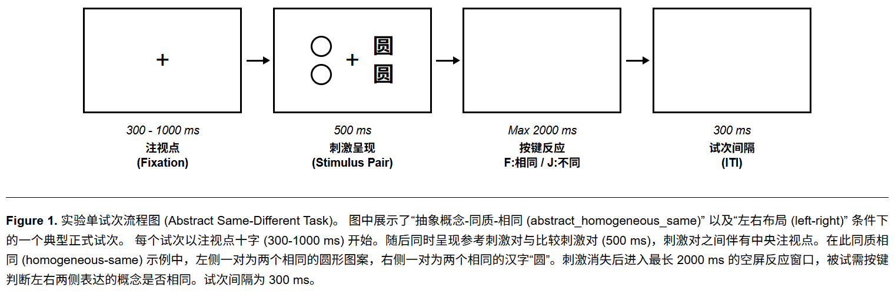

# psych-exp-flowchart

[English](./README.md) | **中文**

> 一个 Claude Code 技能，能从 jsPsych / PsychoPy / MATLAB / Python 代码或自然语言描述中，自动生成符合 APA 规范、可直接投稿的心理学实验流程图。

---



> 在浏览器中打开 [`references/example_psych_experiment_flowchart.html`](./references/example_psych_experiment_flowchart.html) 查看完整的交互示例。

---

## 功能特性

- **代码解析** — 自动读取 `config.js`、`factories.js`、`MATLAB.m` 或 Python `.py` 脚本，提取试次时间轴
- **自然语言输入** — 支持直接描述，如 `"注视点 500ms → 左右呈现两张图片 1000ms → 空屏反应 2000ms"`
- **澄清提问** — 生成前会针对设计中的模糊之处提出 1–3 个问题，确保输出与你的实验设计完全一致
- **APA 排版规范** — 纯黑白、Arial 字体、时间参数斜体、动作标签加粗
- **CSS 变量面板** — 所有尺寸、间距、颜色均为顶部 CSS 变量，无需触碰布局代码即可调整
- **独立 HTML 文件** — 双击即可在浏览器中打开，无需服务器或网络，直接截图使用

## 输出规范

| 属性 | 说明 |
|---|---|
| 格式 | 独立 `.html` 文件 |
| 样式 | APA 规范（黑白、无衬线字体） |
| 实线边框 | 正式实验试次 |
| 虚线边框 | 练习试次 |
| 斜体文字 | 时间参数（ms） |
| **粗体文字** | 动作标签 / 按键提示 |
| 外部依赖 | 无 |

## 安装方法

**方式 A — 复制技能文件夹**

```bash
# macOS / Linux
cp -r psych-exp-flowchart ~/.claude/skills/

# Windows（PowerShell）
Copy-Item -Recurse psych-exp-flowchart "$env:USERPROFILE\.claude\skills\"
```

**方式 B — 克隆到 skills 目录**

```bash
cd ~/.claude/skills
git clone https://github.com/<your-repo>/psych-exp-flowchart
```

安装后，在所有新的 Claude Code 会话中自动生效。

## 使用方法

用自然语言描述需求即可，Claude 会自动识别并使用该技能。

**从代码生成：**

> "读取 `public/task-two-array-v2/` 目录下的 `config.js` 和 `factories.js`，生成实验流程图。"

**从文字描述生成：**

> "生成流程图：注视点 300–1000 ms → 两列图形 500 ms（左右或上下布局）→ 空屏反应 2000 ms → ITI 300 ms。按键：F = 相同，J = 不同。"

**带练习阶段：**

> "生成包含练习阶段（含正误反馈）和正式试次的完整流程图。"

## 工作流程

1. **提取** — 从代码或文字中提取时间序列、空间布局、按键映射  
2. **澄清** — 针对设计中的模糊处提问 1–3 个问题  
3. **生成** — 带 CSS 变量参数面板的 HTML 文件  
4. **图注** — 自动附加 APA 格式图注

## 示例文件

[`references/example_psych_experiment_flowchart.html`](./references/example_psych_experiment_flowchart.html) 展示了：

- 练习阶段（虚线边框）+ 正误反馈
- 正式试次（实线边框）
- CSS 变量参数面板
- APA 格式图注

## 支持的实验框架

| 框架 | 输入类型 |
|---|---|
| jsPsych | `config.js`、`index.html`、`factories.js` |
| PsychoPy | `.py` 实验脚本 |
| MATLAB | `.m` 脚本 |
| 自定义 | 自然语言描述 |

## 许可证

MIT
